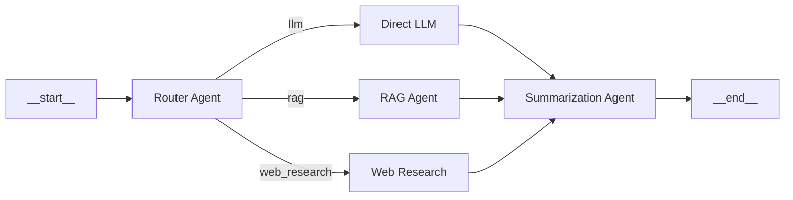

# 🔄 LangGraph Multi-Agent Research and Summarization System

A production-grade **LangGraph-based multi-agent system** demonstrating graph-based agent coordination with routing, retrieval-augmented generation (RAG), web research, and intelligent summarization.

## 🎯 Overview

This project implements a sophisticated LangGraph workflow that:
- Routes queries to the most appropriate agent (LLM, RAG, or Web Research)
- Retrieves contextual information from local knowledge base (RAG)
- Searches the web for real-time information (Tavily)
- Generates comprehensive summaries combining all sources
- Uses **Groq** for ultra-fast LLM inference

## 🏗️ Architecture

### Graph-Based Workflow



### Agent Responsibilities

| Agent | Responsibility | When Triggered |
|-------|---------------|----------------|
| **Router** | Analyzes query intent, routes to appropriate agent | Always (first node) |
| **Direct LLM** | Handles general knowledge questions | Simple factual queries |
| **RAG Agent** | Retrieves from local knowledge base | Domain-specific questions (AI/ML corpus) |
| **Web Research** | Searches web for current information | Real-time events, recent news |
| **Summarization** | Consolidates all sources into final answer | Always (final node) |

### Technology Stack

| Component | Technology | Purpose |
|-----------|-----------|---------|
| **Orchestration** | LangGraph 0.2+ | Graph-based agent workflow |
| **LLM** | Groq (llama-3.3-70b-versatile) | Ultra-fast inference |
| **Embeddings** | HuggingFace (all-MiniLM-L6-v2) | Local, free embeddings |
| **Vector Store** | ChromaDB | Persistent document storage |
| **Web Search** | Tavily API | Advanced web search |
| **Memory** | MemorySaver | Conversation persistence |

## 🔑 Key Features

- **Intelligent Routing**: Automatically selects optimal agent based on query type
- **Multi-Source RAG**: Combines local knowledge base with web search
- **Graph-Based Coordination**: LangGraph enables complex, non-linear workflows
- **Persistent Memory**: ChromaDB for vector storage, MemorySaver for conversations
- **Free Embeddings**: HuggingFace models (no API key needed)
- **Real-Time Search**: Tavily integration for current events
- **Streaming Support**: Real-time token streaming for better UX

## 🛠️ Technical Specifications

### Graph State Definition

```python
class AgentState(TypedDict):
    query:             str              # User question
    route:             str              # 'llm' | 'rag' | 'web_research'
    retrieved_context: str              # RAG/Web results
    llm_response:      str              # Direct LLM answer
    final_summary:     str              # Consolidated answer
    messages:          List[BaseMessage] # Conversation history
    metadata:          dict             # Timestamps, sources
```

### Routing Logic

The router agent uses LLM reasoning to classify queries:

```python
def router_node(state: AgentState) -> AgentState:
    """Routes query to appropriate agent based on intent."""
    
    system_prompt = """Analyze the user query and route to:
    
    - 'llm': General knowledge, definitions, explanations
    - 'rag': Questions about AI/ML in the knowledge base
    - 'web_research': Current events, recent news, real-time data
    
    Respond with ONLY one word: llm, rag, or web_research
    """
    
    response = llm.invoke([
        SystemMessage(content=system_prompt),
        HumanMessage(content=state['query'])
    ])
    
    route = response.content.strip().lower()
    return {"route": route}
```

## 📋 Prerequisites

- Python 3.10+
- Groq API Key ([Get it here](https://console.groq.com))
- Tavily API Key ([Get it here](https://tavily.com))
- Google Colab (recommended) or local Jupyter environment

## 🚀 Quick Start

### 1. Install Dependencies

```bash
pip install langgraph langchain langchain-groq langchain-community \
    langchain-chroma chromadb sentence-transformers tavily-python \
    langchain-huggingface
```

### 2. Set Up API Keys

**Google Colab** (recommended):

```python
from google.colab import userdata
import os

os.environ['GROQ_API_KEY']   = userdata.get('GROQ_API_KEY')
os.environ['TAVILY_API_KEY'] = userdata.get('TAVILY_API_KEY')
```

**Local Environment**:

```bash
# Windows PowerShell
$env:GROQ_API_KEY="your_groq_api_key_here"
$env:TAVILY_API_KEY="your_tavily_api_key_here"

# Linux/Mac
export GROQ_API_KEY="your_groq_api_key_here"
export TAVILY_API_KEY="your_tavily_api_key_here"
```

### 3. Run the Notebook

Open `langgraph_multi_agent_groq.ipynb` in Jupyter or Google Colab and run all cells.

### 4. Query the System

```python
# Example queries
query1 = "What is Agentic AI?"  # Routes to: RAG
query2 = "Who won the 2024 US presidential election?"  # Routes to: web_research
query3 = "Explain quantum computing"  # Routes to: llm

# Execute
result = graph.invoke({
    "query": query1,
    "messages": [],
    "metadata": {}
})

print(result['final_summary'])
```

## 📊 Example Workflows

### Scenario 1: RAG Query

**Query**: "What are the key components of Agentic AI?"

**Workflow**:
```
__start__ → router_node → rag_node → summarization_node → __end__
              ↓              ↓            ↓
           route='rag'   ChromaDB     Combine context
                         retrieval    + LLM reasoning
```

**Output**:
```
Based on the knowledge base, Agentic AI consists of:

1. **Perception**: Sensing and understanding the environment
2. **Planning**: Decomposing goals into actionable steps
3. **Action**: Executing tasks using tools and APIs
4. **Memory**: Maintaining short-term and long-term context
5. **Reasoning**: Making decisions based on logic and data

Key frameworks implementing these components include:
- AutoGen (multi-agent collaboration)
- LangGraph (graph-based workflows)
- CrewAI (role-playing agents)

Source: Local knowledge base (AI/ML documents)
```

---

### Scenario 2: Web Research Query

**Query**: "Latest developments in OpenAI GPT models in 2026"

**Workflow**:
```
__start__ → router_node → web_research_node → summarization_node → __end__
              ↓              ↓                     ↓
         route='web'    Tavily search        Combine + summarize
                        (real-time)
```

**Output**:
```
As of March 2026, recent OpenAI GPT developments include:

1. **GPT-5 Release** (Q1 2026):
   - 10x improvement in reasoning capabilities
   - Native multi-modal support (text, image, audio, video)
   - Context window extended to 1 million tokens

2. **Enterprise Features**:
   - Custom model fine-tuning for organizations
   - Enhanced data privacy controls
   - API cost reduction by 40%

3. **Safety Improvements**:
   - Advanced alignment techniques reducing harmful outputs
   - Transparent AI safety reports

Sources: 
- TechCrunch (March 2, 2026)
- OpenAI Blog (March 1, 2026)
- VentureBeat (February 28, 2026)
```

---

### Scenario 3: Direct LLM Query

**Query**: "Explain the difference between gradient descent and stochastic gradient descent"

**Workflow**:
```
__start__ → router_node → llm_node → summarization_node → __end__
              ↓             ↓             ↓
          route='llm'   Direct       Format output
                        reasoning
```

**Output**:
```
**Gradient Descent (GD)**:
- Computes gradient using the ENTIRE dataset
- Updates: θ = θ - α∇J(θ), where J(θ) = (1/m)Σ loss
- Pros: Stable convergence, exact gradient
- Cons: Slow for large datasets (O(m) per step)

**Stochastic Gradient Descent (SGD)**:
- Computes gradient using a SINGLE example at a time
- Updates: θ = θ - α∇J(θ; xᵢ, yᵢ)
- Pros: Fast updates, escapes local minima
- Cons: Noisy updates, unstable convergence

**Mini-Batch SGD** (most common in practice):
- Compromise: uses batches of size 32-256
- Best of both worlds
```

## 🔧 Configuration

### LLM Configuration

```python
llm = ChatGroq(
    model='llama-3.3-70b-versatile',  # Groq's fastest model
    temperature=0,                     # Deterministic for routing/RAG
    max_tokens=2048,
)
```

### RAG Configuration

**Vector Store**:
```python
vectorstore = Chroma(
    collection_name="ai_ml_knowledge",
    embedding_function=embeddings,
    persist_directory="./chroma_db"  # Persistent storage
)
```

**Retrieval**:
```python
retriever = vectorstore.as_retriever(
    search_type="similarity",
    search_kwargs={"k": 5}  # Top 5 most relevant chunks
)
```

### Web Search Configuration

```python
web_search_tool = TavilySearchResults(
    max_results=5,
    search_depth='advanced',      # More comprehensive
    include_answer=True,           # Get AI-generated summary
    include_raw_content=False,     # Exclude full HTML
)
```

### Graph Compilation

```python
workflow = StateGraph(AgentState)

# Add nodes
workflow.add_node("router", router_node)
workflow.add_node("llm", llm_node)
workflow.add_node("rag", rag_node)
workflow.add_node("web_research", web_research_node)
workflow.add_node("summarization", summarization_node)

# Set entry point
workflow.set_entry_point("router")

# Add conditional routing
workflow.add_conditional_edges(
    "router",
    lambda state: state["route"],  # Route based on state
    {
        "llm": "llm",
        "rag": "rag",
        "web_research": "web_research"
    }
)

# All paths converge to summarization
workflow.add_edge("llm", "summarization")
workflow.add_edge("rag", "summarization")
workflow.add_edge("web_research", "summarization")
workflow.add_edge("summarization", END)

# Compile with memory
memory = MemorySaver()
graph = workflow.compile(checkpointer=memory)
```

## 🎓 Knowledge Base Setup

The system includes sample AI/ML documents. To add your own:

```python
# Add documents to ChromaDB
documents = [
    Document(
        page_content="Your content here...",
        metadata={"source": "document.pdf", "page": 1}
    )
]

# Create embeddings and store
vectorstore = Chroma.from_documents(
    documents=documents,
    embedding=embeddings,
    persist_directory="./chroma_db"
)
```

## 🎓 Learning Outcomes

This project demonstrates:

1. **LangGraph Fundamentals**: Building graph-based agent workflows
2. **Conditional Routing**: Dynamic agent selection based on query intent
3. **RAG Implementation**: Vector stores, embeddings, retrieval
4. **Multi-Source Synthesis**: Combining local knowledge + web search
5. **State Management**: Passing context through graph nodes
6. **Memory Persistence**: ChromaDB for vectors, MemorySaver for conversations
7. **API Integration**: Groq LLM, Tavily search, HuggingFace embeddings

## 🐛 Troubleshooting

### Common Issues

**Issue**: `ModuleNotFoundError: No module named 'langgraph'`
- **Solution**: Install LangGraph: `pip install langgraph`

**Issue**: `Invalid API Key (Groq/Tavily)`
- **Solution**: Verify keys are set correctly in environment or Colab secrets

**Issue**: `ChromaDB not persisting data`
- **Solution**: Ensure `persist_directory` is set and writable

**Issue**: `HuggingFace embeddings slow on first run`
- **Solution**: Model downloads on first use (~90MB). Subsequent runs are fast.

**Issue**: `Router selecting wrong agent`
- **Solution**: Refine router's system prompt with more examples

**Issue**: `Tavily rate limit`
- **Solution**: Free tier: 1,000 requests/month. Implement caching or upgrade plan.

## 📚 Additional Resources

### LangGraph Documentation
- [Official Docs](https://langchain-ai.github.io/langgraph/)
- [Tutorials](https://langchain-ai.github.io/langgraph/tutorials/)
- [API Reference](https://langchain-ai.github.io/langgraph/reference/)

### Related Technologies
- [LangChain Documentation](https://python.langchain.com/)
- [Groq Platform](https://console.groq.com/docs)
- [Tavily API Docs](https://docs.tavily.com/)
- [ChromaDB Guide](https://docs.trychroma.com/)

### Research Papers
- [LangGraph: Multi-Agent Workflows](https://blog.langchain.dev/langgraph-multi-agent-workflows/)
- [RAG Survey Paper](https://arxiv.org/abs/2312.10997)

## 🔄 Extending the Project

### Enhancement Ideas

1. **Multi-Turn Conversations**:
   - Add conversation history to state
   - Implement follow-up question handling

2. **Advanced RAG**:
   - Hybrid search (dense + sparse)
   - Re-ranking with cross-encoders
   - Multi-query retrieval

3. **Tool Integration**:
   - Calculator for math queries
   - Code execution sandbox
   - Database queries (SQL)

4. **Streaming Output**:
   ```python
   for chunk in graph.stream({"query": "..."}):
       print(chunk)
   ```

5. **Human-in-the-Loop**:
   - Add approval nodes for critical decisions
   - Implement feedback loops

6. **Evaluation**:
   - Add retrieval quality metrics (precision, recall)
   - Track routing accuracy
   - Measure answer relevance (RAGAS framework)

## 📊 Performance Benchmarks

| Operation | Time | Notes |
|-----------|------|-------|
| Router | 0.5-1s | LLM call for classification |
| RAG Retrieval | 0.2-0.5s | ChromaDB similarity search |
| Web Search | 1-2s | Tavily API latency |
| LLM Generation | 1-3s | Groq inference (very fast) |
| Total (RAG) | 2-5s | End-to-end |
| Total (Web) | 3-6s | End-to-end |

*Times on Google Colab with T4 GPU*

## 📄 License

This project is part of the Pinnacle Projects portfolio.

## 🤝 Contributing

Contributions are welcome! Areas for improvement:
- Add more document loaders (CSV, JSON, HTML)
- Implement advanced routing (semantic, learned)
- Add evaluation benchmarks
- Create Streamlit UI
- Deploy as REST API (FastAPI)

---

## 🎯 Next Steps

After mastering LangGraph, explore:
- **LangGraph Cloud**: Hosted agent deployments
- **Multi-Modal Agents**: Image, audio, video processing
- **Production Deployment**: Docker, Kubernetes, monitoring

---

**Part of the Pinnacle Projects - L4: Building Advanced AI Agents with LangGraph**
